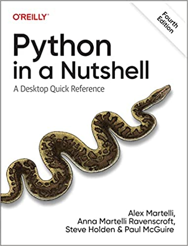

# Online Content and Code Snippets for Python in a Nutshell, 4 Ed.

### Copyright © 2023, by Alex Martelli, Anna Ravenscroft, Steve Holden, and Paul McGuire. All rights reserved.
### Published by O'Reilly Media Inc.

This repository contains the online content and code snippets presented in 
[Python in a Nutshell, 4 Ed.](https://www.oreilly.com/library/view/python-in-a/9781098113544/)

## Online Chapters

- [Chapter 24 - Packaging Programs and Extensions](./chapters/24%20Packaging%20Programs%20and%20Extensions.pdf)
- [Chapter 25 - Extending and Embedding Classic Python](./chapters/25%20Extending%20and%20Embedding%20Classic%20Python.pdf)

## Code Snippets

- [Chapter 1 - Introduction to Python](./01_Introduction_to_Python)
- [Chapter 2 - The Python Interpreter](./02_The_Python_Interpreter)
- [Chapter 3 - The Python Language](./03_The_Python_Language)
- [Chapter 4 - Object-Oriented Python](./04_Object_Oriented_Python)
- [Chapter 5 - Type Annotations](./05_Type_Annotations)
- [Chapter 6 - Exceptions](./06_Exceptions)
- [Chapter 7 - Modules](./07_Modules)
- [Chapter 8 - Core Builtins and Standard Library Modules](./08_Core_Builtins_and_Standard_Library_Modules)
- [Chapter 9 - Strings and Things](./09_Strings_and_Things)
- [Chapter 10 - Regular Expressions](./10_Regular_Expressions)
- [Chapter 11 - File and Text Operations](./11_File_and_Text_Operations)
- [Chapter 12 - Persistence and Databases](./12_Persistence_and_Databases)
- [Chapter 13 - Time Operations](./13_Time_Operations)
- [Chapter 14 - Controlling Execution](./14_Contolling_Execution)
- [Chapter 15 - Threads and Processes](./15_Threads_and_Processes)
- [Chapter 16 - Numeric Processing](./16_Numeric_Processing)
- [Chapter 17 - Testing, Debugging, and Optimizing](./17_Testing_Debugging_and_Optimizing)
- [Chapter 18 - Basic Networking](./18_Basic_Networking)
- [Chapter 19 - Client Side Network Protocol Modules](./19_client_side_network_protocol_modules)
- [Chapter 20 - Serving HTTP](./20_serving_http)
- [Chapter 21 - Email, MIME, and Other Network Encodings](./21_Email_MIME_and_Other_Network_Encodings)
- [Chapter 22 - Structured Text: HTML](./22_Structured_Text_HTML)
- [Chapter 23 - Structured Text: XML](./23_Structured_Text_XML)
- [Chapter 24 - Distributing Extensions and Programs](./24_Distributing_Extensions_and_Programs)
- [Chapter 25 - Extending and Embedding Classic Python](./25_Extending_and_Embedding_Classic_Python)

The code snippets will be in the form of a standard script that can be extracted and run using your local
Python environment. However, for those book examples that show an interactive session, the snippets 
in this repository will run the example using doctest to recreate and run these sessions. 

You can find more information about doctest in the book content, _Chapter 17 - Testing, Debugging, and Optimizing_.
